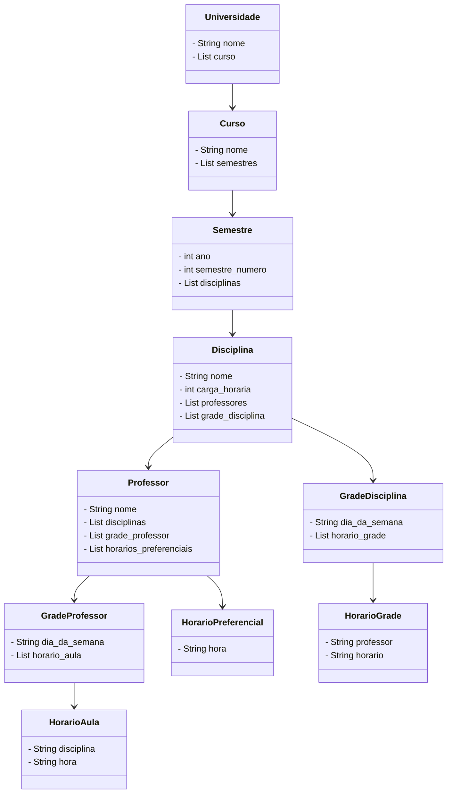

# API Rest Alocação de Horários
## Contextualizando Domínio
Instituição Superior

### Necessidades do Projeto

O projeto precisa desenvolver um sistema que permita aos professores alocar suas
disciplinas na grade de horários da semana e indicar suas preferências de dias e horários.

 -  Criar um sistema de cadastro para professores, cursos e disciplinas.

### Diagrama de Classes

