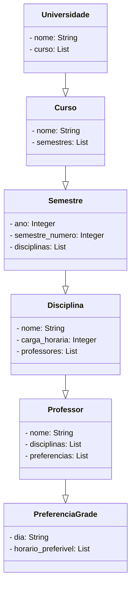
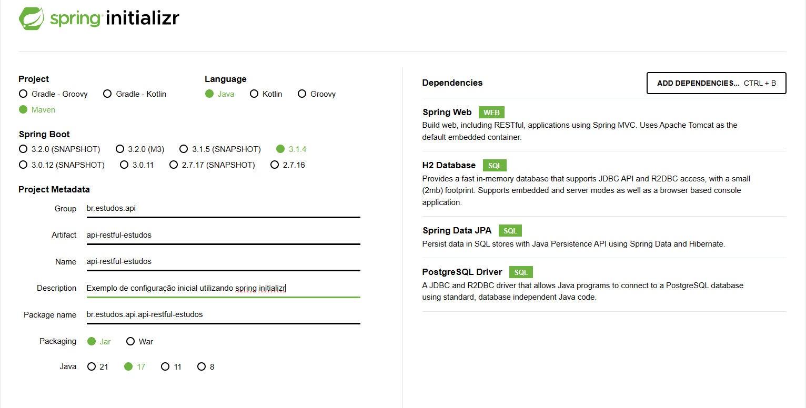

# Estudos API Restfull
## Contextualizando Domínio
A proposta para o desenvolvimento deste estudo é relacionado ao escopo universitário,
onde temos como domínio a Instituição de Ensino Superior com a seguinte necessidade:

O projeto precisa desenvolver um sistema que permita aos professores alocar suas
disciplinas na grade de horários da semana e indicar suas preferências de dias e horários.

-  Criar um sistema de cadastro para professores, cursos e disciplinas.

Baseando-se no contexto acima, foi gerado o seguinte diagrama para representação do conceito acima:
### Diagrama de Classes



### Definições
#### API
Acrônimo para Application Programming Interface é um recurso que permite a comunicação entre softwares e plataformas utilizando um conjunto de definições e protocolos.
Onde é disponibilizado uma interface para que outros possam consumir determinado serviço, sem ter a preocupação com sua implementação.

#### Padrão REST
API REST é uma API que se adéqua aos princípios de design do REST ou o estilo de arquitetura do Representational State Transfer.

##### 6 Principais Princípios de Design REST

| Interface Uniforme                                                                                     | Desacoplamento do cliente-servidor                                                                                                                      | Sem estado definido                                                                                              |
|--------------------------------------------------------------------------------------------------------|---------------------------------------------------------------------------------------------------------------------------------------------------------|------------------------------------------------------------------------------------------------------------------|
| Todas as solicitações para o mesmo recurso devem ser iguais, não importa a origem da solicitação.      | Aplicativos cliente e servidor devem ser completamente independentes um do outro.                                                                       | Cada solicitação precisa incluir todas as informações necessárias para processá-lo.                              |
| Deve garantir que a mesma parte de dados pertença apenas a um identificador de recurso uniforme (URI). | A única informação que o aplicativo cliente deve receber é a URI do recurso solicitado, não podendo interagir com o aplicativo de qualquer outra forma. | APIs de REST não requerem nenhuma sessão do lado do servidor.                                                    |
| Os recursos não devem ser muito grandes mas devem conter todas informações necessárias do cliente.     | Da mesma maneira um aplicativo do servidor não deve modificar o aplicativo cliente, exceto para transferi-los aos dados solicitados via HTTP.           | Os aplicativos do servidor não tem permissão para armazenar nenhum dado relacionado a uma solicitação de cliente.|

| Capacidade de armazenamento em cache                                                                           | Arquitetura de sistema em camadas                                                                                                                                                    | Código sob demanda (opcional)                                                                                                                      |
|----------------------------------------------------------------------------------------------------------------|--------------------------------------------------------------------------------------------------------------------------------------------------------------------------------------|----------------------------------------------------------------------------------------------------------------------------------------------------|
| Quando possível, os recursos devem ser armazenados em cache pelo cliente ou servidor.                          | As chamadas e respostas passam por diferentes camadas.                                                                                                                               | As APIs de REST geralmente enviam recursos estáticos, mas em certos casos, as respostas também podem conter código executável (como applets Java). |                                                                                                                        
| As respostas do servidor também precisam conter informações sobre as permissões de cache do recurso fornecido. | De maneira geral, não assuma que os aplicativos cliente e servidor se conectem diretamente um ao outro, podendo haver uma série de intermediários diferentes no loop de comunicação. | Nestes casos, o código deve ser executado somente sob demanda.                                                                                     |
| O objetivo é melhorar o desempenho do cliente, além de aumentar a escalabilidade do servidor.                  | Precisam ser projetadas para que nem o cliente e nem o servidor possam dizer se ele se comunica com o aplicativo final ou um intermediário.                                          |                                                                                                                                                    |

Para mais informações a respeito de API segue o [link](https://www.ibm.com/br-pt/topics/rest-apis#:~:text=O%20%C3%BAnico%20requisito%20%C3%A9%20que%20eles%20devem%20alinhar,camadas.%20...%206%20C%C3%B3digo%20sob%20demanda%20%28opcional%29.%20) 👈
### Ferramentas utilizadas
#### Spring Framework
Um ecossistema de desenvolvimento para facilitar a criação de aplicações Java, baseado nos padrões de projetos de inversão de controle (IoC) e injeção de dependência.<br>
#### Spring Boot
Abstrair a complexibilidade e facilitar na configuração de nossas dependência<br>
Site: [spring initializr](https://start.spring.io/)

#### H2 DataBase (dependência)
Este recurso nos possibilita trabalhar com banco de dados em memória mediante a configuração<br>


````
#Nome do arquivo: aplication.properties, segue as configurações

# H2
spring.h2.console.enabled=true 
spring.h2.console.path=/h2-console

# Datasource
spring.datasource.url=jdbc:h2:mem:teste
spring.datasource.username=srv
spring.datasource.password=
spring.datasource.driver-class-name=org.h2.Driver
spring.jpa.hibernate.ddl-auto=create-drop
spring.jpa.show-sql=true
spring.jpa.database-platform=org.hibernate.dialect.H2Dialect
spring.jpa.properties.hibernate.format_sql=true
````
Observação:<br>
A estrutura acima diz respeito a configuração de um arquivo aplication.properties, porém o Spring Boot aceita outro tipo de arquivo que é o application.yml.

URL de acesso ao banco h2, levando em conta a configuração acima: localhost:port/path<br>
port por default  é 8080 e o path foi passado por configuração;
#### Open API
É uma biblioteca que auxilia na criação de documentação e testes de nossa API, através da  integração entre Spring Boot e Swagger<br>
Documentação [OpenAPI](https://github.com/springdoc/springdoc-openapi) 👈

#### [Raiway](https://railway.app/new) 


#### 📙 Estrutura em 3 camadas

##### Controller 
Referente a API, onde disponibilizamos os endpoints, métodos HTTP, a comunicação com os DTOs, os status HTTP etc...

##### Service
Possuí nossas  regras de negócio, em suma é onde definimos como cada processo ocorre dentro de nossa aplicação.

##### Repository (DAO, "Data Access Object")
Se comunica com o banco de dados a fim de persistir os mesmos.


